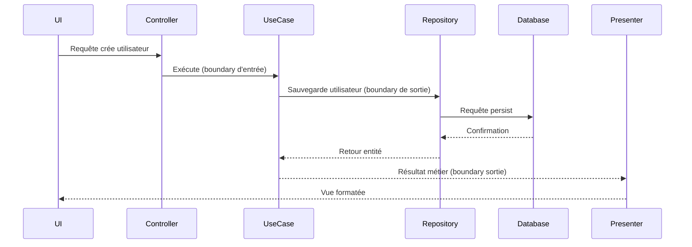

# Le Concept de "Boundary" : Comment les données traversent les couches de la Clean Architecture

La Clean Architecture structure les systèmes logiciels en couches concentriques dont la communication est régulée par des **boundaries** (frontières). Comprendre comment les données traversent ces boundaries est clé pour maintenir la **séparation des préoccupations**, la **testabilité** et la **flexibilité** du système.

---

## 1. Définition du concept de "Boundary"

Un **boundary** représente une interface claire et explicite entre deux couches ou composants de l’architecture. Il sert à :

- Définir des contrats d’échange  
- Protéger la couche interne des changements dans la couche externe  
- Contrôler la manière dont les données et les appels sont transmis

Dans la Clean Architecture, les boundaries séparent typiquement :

- Les cas d’utilisation (Use Cases) de la couche interface (UI, API).  
- La logique métier de la couche infrastructure (bases de données, services externes).  

---

## 2. Le cheminement des données à travers les boundaries

Les données circulent en respectant ces règles :

- **Entrée dans le système** : l’utilisateur ou une source externe émet une requête reçue par un contrôleur.  
- **Traversal boundary entrant** : le contrôleur traduit cette requête en un modèle ou commande métier, qu’il transmet au use case via une interface (boundary d’entrée).  
- **Traitement interne** : le use case exécute la logique métier, potentiellement en interrogeant des gateways (boundary sortante) vers la base ou API externe.  
- **Retour des résultats** : les données métier sont renvoyées par le use case au présentateur, via le boundary, qui les transforme en modèles spécifiques à l’interface (DTO, ViewModel).  
- **Sortie vers l’utilisateur** : les données adaptées sont affichées ou transmises.

---

## 3. Exemple simplifié

Supposons un système de gestion d’utilisateur. Voici le flux de données à travers les boundaries :

1. **UI** → HTTP request : `{ nom:"Alice", email:"alice@ex.com" }`  
2. **Contrôleur** : convertit en requête métier `CréerUtilisateurRequest`.  
3. **Boundary d’entrée** : interface `ICreerUtilisateurUseCase.Execute(CreerUtilisateurRequest)`.  
4. **Use Case** : traite la commande, vérifie règles métier.  
5. **Boundary sortante** : appelle via interface `IUtilisateurRepository.Save(Utilisateur)`.  
6. **Infrastructure** : persiste l’entité `Utilisateur` en base.  
7. **Use Case** : retourne un résultat métier `UtilisateurResult`.  
8. **Présentateur** : convertit en `UtilisateurViewModel`.  
9. **UI** : affiche le résultat.

---

## 4. Diagramme Mermaid illustrant le flux des données avec boundaries

---

## 5. Bonnes pratiques pour bien gérer les boundaries

- Définir des interfaces claires, simples et stables sur chaque boundary.  
- Ne jamais exposer directement les entités ou structures métier dans les couches externes.  
- Transformer les données au passage des boundaries (DTO, ViewModel).  
- Protéger les couches internes des détails spécifiques aux frameworks ou infrastructures.  
- Injecter les implémentations concrètes dans les couches externes pour respecter l’inversion des dépendances.

---

## 6. Sources et références

- Robert C. Martin, *Clean Architecture*, 2017  
- Uncle Bob, [The Clean Architecture Explained](https://blog.cleancoder.com/uncle-bob/2012/08/13/the-clean-architecture.html)  
- Microsoft Docs, [Clean Architecture and Layers](https://docs.microsoft.com/en-us/dotnet/architecture/modern-web-apps-azure/common-web-application-architectures#layers)  
- Vaughn Vernon, *Implementing Domain-Driven Design*, 2013  
- Martin Fowler, [Patterns of Enterprise Application Architecture](https://martinfowler.com/books/eaa.html)

---

Le concept de boundary structure la communication et assure l'indépendance des différentes couches. En encadrant précisément le passage des données, il garantit un système robuste, adaptable et compréhensible.