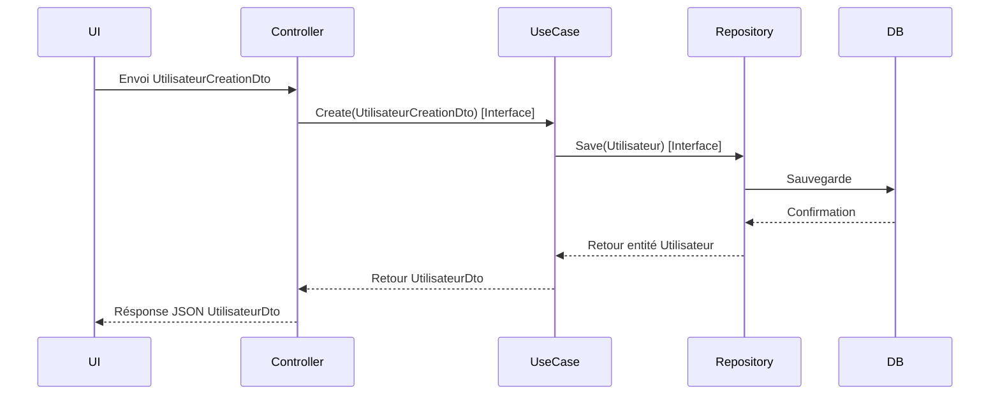

# Le rôle des interfaces et des DTOs dans le concept de "Boundary" de la Clean Architecture

Le concept de **boundary** (frontière) dans la Clean Architecture définit des points de communication clairs entre les différentes couches. Ces frontières sont matérialisées par des **interfaces** et des **DTOs (Data Transfer Objects)**, qui jouent un rôle central dans la gestion du couplage, la maintenabilité et la clarté des échanges de données.

---

## 1. Interfaces : délimiter et formaliser les boundaries

### Fonction des interfaces dans la Clean Architecture

- **Contractualiser les échanges** entre couches sans imposer de dépendances concrètes.  
- Permettre **l’inversion de dépendances** : les couches internes définissent les interfaces auxquelles les couches externes se conforment.  
- Faciliter le **test unitaire** en permettant de simuler les dépendances externes par des mocks ou stubs.  
- Rendre explicite ce qui est accessible et modifiable à travers une frontière.

### Exemple d’interface définissant un boundary

```csharp
public interface IUtilisateurRepository
{
    Utilisateur GetById(Guid id);
    void Save(Utilisateur utilisateur);
}
```

Cette interface est située dans la couche application/domaine et sera implémentée côté infrastructure, par exemple avec une base de données relationnelle.

---

## 2. DTOs : transporter les données entre couches

### Pourquoi utiliser des DTOs ?

- Les entités métier sont souvent **riches en logique** et ne doivent pas être exposées directement aux couches externes.  
- Les DTOs permettent de **transférer uniquement les données nécessaires** à une interface ou une API.  
- Permettent de **découpler la structure des données métiers** de celle des données affichées ou transmises.  
- Simplifient la sérialisation/désérialisation des données (JSON, XML, etc.).

### Exemple de DTO

```csharp
public class UtilisateurDto
{
    public string NomComplet { get; set; }
    public string EmailMasque { get; set; }
}
```

Un présentateur ou un mapper convertira une entité `Utilisateur` en `UtilisateurDto`, par exemple en masquant l'email.

---

## 3. Interaction entre interfaces et DTOs dans un boundary

- Les **interfaces définissent les méthodes** des use cases et repositories, acceptant ou renvoyant des DTOs ou des objets métier, selon le sens du boundary.  
- Dans la communication **entrant dans l’application**, souvent des DTOs simples sont transformés en objets métiers par les adaptateurs.  
- À la sortie, les entités métier sont converties en DTOs avant d’être transmises à l’interface utilisateur ou à des systèmes externes.

---

## 4. Exemple concret : création d’un utilisateur

1. **Requête HTTP** reçue par un contrôleur avec un `UtilisateurCreationDto`.  
2. Le contrôleur appelle le use case via une interface `ICreerUtilisateurUseCase.Create(UtilisateurCreationDto dto)`.  
3. Le use case convertit le DTO en entité métier `Utilisateur` et applique la logique.  
4. Après traitement, le use case retourne un `UtilisateurDto` simplifié.  
5. Le contrôleur sérialise ce DTO en JSON pour la réponse HTTP.

---

## 5. Diagramme Mermaid illustrant le flux avec interfaces et DTOs



---

## 6. Sources et références

- Robert C. Martin, *Clean Architecture*, 2017  
- Microsoft Docs, [Clean Architecture with ASP.NET Core](https://docs.microsoft.com/en-us/dotnet/architecture/modern-web-apps-azure/common-web-application-architectures#clean-architecture)  
- Martin Fowler, [Data Transfer Object pattern](https://martinfowler.com/eaaCatalog/dataTransferObject.html)  
- Uncle Bob, [The Clean Architecture Explained](https://blog.cleancoder.com/uncle-bob/2012/08/13/the-clean-architecture.html)  

---

Les interfaces et DTOs sont les piliers du concept de boundary. En séparant les responsabilités à travers des contrats abstraits et en véhiculant des données adaptées, ils garantissent la modularité, la flexibilité et la robustesse des architectures orientées domaine.