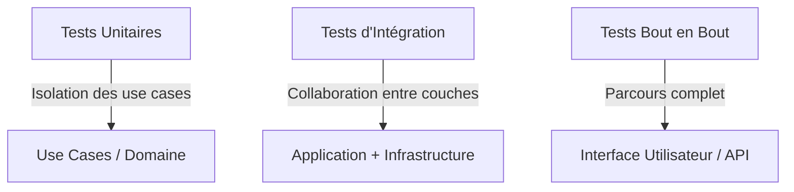

# Stratégies de tests dans la Clean Architecture : unitaires, intégration et bout en bout

La Clean Architecture facilite la mise en place d’une stratégie de tests robuste en structurant clairement les responsabilités et les dépendances. Pour assurer la qualité logicielle, trois types de tests sont généralement combinés : les tests unitaires, les tests d’intégration et les tests de bout en bout (end-to-end).

---

## 1. Tests unitaires : isoler la logique métier

### Objectifs

- Vérifier le comportement d’unités de code individuelles (ex. use cases, services métier, règles de validation).  
- S’assurer que chaque composant fonctionne correctement indépendamment des dépendances externes.  

### Particularité dans la Clean Architecture

- La séparation claire entre les couches facilite l’isolation des use cases et des entités.  
- Les dépendances externes (repositories, services externes) sont mockées ou stubées grâce aux interfaces.

### Exemple en C# avec un use case

```csharp
public class CalculerPrixUseCaseTests
{
    [Fact]
    public void CalculerPrix_RetourneTotalAvecTaxe()
    {
        // Arrange
        var repositoryMock = new Mock<IProduitRepository>();
        repositoryMock.Setup(r => r.GetById(It.IsAny<int>())).Returns(new Produit { Prix = 100 });
        var useCase = new CalculerPrixUseCase(repositoryMock.Object, 0.2);

        // Act
        var resultat = useCase.Calculer(1);

        // Assert
        Assert.Equal(120, resultat);
    }
}
```

---

## 2. Tests d’intégration : vérifier la collaboration entre composants

### Objectifs

- Valider que plusieurs composants fonctionnent ensemble comme prévu (ex. use case + base de données + repository).  
- Tester les interactions avec l’infrastructure (base de données, messages, API tierces).

### Approches

- Utiliser une base de données en mémoire ou un environnement de test dédié.  
- Charger le contexte complet de l’application (dependency injection).  
- Tester des scénarios métier couvrant plusieurs couches.

### Exemple avec Entity Framework Core en mémoire

```csharp
public class CommandeRepositoryTests
{
    [Fact]
    public void Save_PersisteCommandeEnBDD()
    {
        var options = new DbContextOptionsBuilder<AppDbContext>()
            .UseInMemoryDatabase(databaseName: "TestDB")
            .Options;

        using (var context = new AppDbContext(options))
        {
            var repo = new CommandeRepository(context);
            var commande = new Commande { Id = 1, Total = 100 };

            repo.Save(commande);

            Assert.Equal(1, context.Commandes.Count());
            Assert.Equal(100, context.Commandes.Single().Total);
        }
    }
}
```

---

## 3. Tests de bout en bout (End-to-End) : simuler le parcours utilisateur complet

### Objectifs

- Valider l’application complète du point de vue de l’utilisateur : interface, back-end, base de données.  
- Tester les scénarios métier dans un environnement proche de la production.

### Outils

- Selenium, Cypress (tests UI automatisés).  
- API tests avec Postman ou REST Assured.  
- Environnements d’intégration continue avec base de données dédiée.

### Exemple simple de test E2E avec Cypress (test d’une API REST)

```js
describe('API Utilisateur', () => {
  it('Permet de créer un utilisateur', () => {
    cy.request('POST', '/api/utilisateurs', { nom: 'Alice', email:'alice@mail.com' })
      .its('status')
      .should('eq', 200);
  });
});
```

---

## 4. Synthèse des tests dans la Clean Architecture



Chaque type de test joue un rôle complémentaire, renforçant la robustesse globale.

---

## 5. Références

- Robert C. Martin, *Clean Architecture*, 2017  
- Microsoft Docs, [Testing in .NET](https://docs.microsoft.com/en-us/dotnet/core/testing/)  
- Martin Fowler, [Testing Pyramid](https://martinfowler.com/bliki/TestPyramid.html)  
- Cypress Documentation, https://www.cypress.io  
- Roy Osherove, *The Art of Unit Testing*, 2013  

---

Structurer l’architecture avec des boundaries claires rend la mise en place de ces tests plus simple et efficace. Isoler la logique métier par les tests unitaires, valider la collaboration des composants avec les tests d’intégration, et garantir l’expérience utilisateur via les tests bout en bout forment un ensemble cohérent pour la qualité du logiciel.