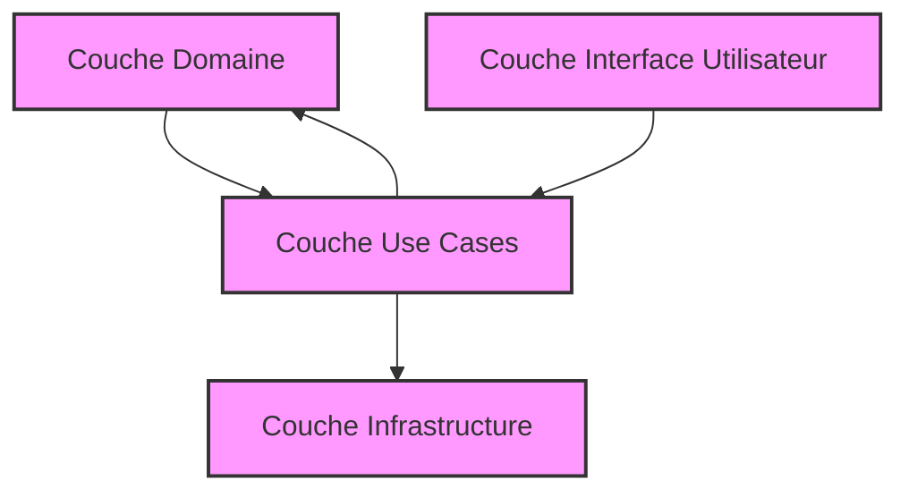

# Comment tester chaque couche de la Clean Architecture de manière isolée

La Clean Architecture sépare clairement un système en couches : domaine, application (use cases), infrastructure, et interface utilisateur. Cette organisation facilite les tests, à condition de **tester chaque couche isolément**, selon ses responsabilités et ses dépendances, pour garantir robustesse et maintenabilité.

---

## 1. Tester la couche Domaine

### Objectif

- Valider la **logique métier** pure : entités, règles métier, agrégats.  
- Aucun accès aux détails externes (base de données, réseau).  
- Pas besoin de mocks complexes : tests très rapides.  

### Pratique

- Écrire des tests unitaires ciblés sur les entités et objets métier.  
- S’assurer que les invariants métier sont respectés.  

### Exemple en C#

```csharp
[Fact]
public void Utilisateur_Valide_Email_Doivent_reussir()
{
    var utilisateur = new Utilisateur("alice@mail.com");
    Assert.True(utilisateur.EmailEstValide());
}
```

---

## 2. Tester la couche Use Cases (Application)

### Objectif

- Vérifier que les cas d’utilisation orchestrent correctement les opérations métier.  
- Isoler les dépendances externes (repositories, services) via des interfaces mockées.  

### Pratique

- Injecter des mocks/stubs des interfaces des repositories ou services.  
- Tester les scénarios métier complets.  

### Exemple avec Moq (C#)

```csharp
[Fact]
public void CreerCommande_Appelle_le_repository_pour_sauvegarder()
{
    var repoMock = new Mock<ICommandeRepository>();
    var useCase = new CreerCommandeUseCase(repoMock.Object);

    useCase.Executer(new CommandeDto(...));

    repoMock.Verify(r => r.Save(It.IsAny<Commande>()), Times.Once);
}
```

---

## 3. Tester la couche Infrastructure

### Objectif

- Vérifier les implémentations concrètes (accès DB, appel API).  
- Tester la connexion aux ressources externes (souvent tests d’intégration).  

### Pratique

- Utiliser des bases en mémoire ou conteneurs pour bases réelles (ex. PostgreSQL Docker).  
- Tester la persistance et récupération des données.  

### Exemple avec Entity Framework Core InMemory

```csharp
[Fact]
public void Save_PersisteCommandeEnBase()
{
    var options = new DbContextOptionsBuilder<AppDbContext>()
        .UseInMemoryDatabase("TestDB")
        .Options;
    using var context = new AppDbContext(options);
    var repo = new CommandeRepository(context);

    var commande = new Commande { Id = 1 };
    repo.Save(commande);

    Assert.Equal(1, context.Commandes.Count());
}
```

---

## 4. Tester la couche Interface utilisateur (UI)

### Objectif

- Valider l’affichage, l’interaction utilisateur, et la communication avec le backend.  
- Tests fonctionnels ou bout en bout.  

### Pratique

- Utiliser des frameworks de test UI (Selenium, Cypress).  
- Mock ou stub API backend si nécessaire.  

### Exemple simple avec Cypress

```js
describe('Page création commande', () => {
  it('soumet un formulaire avec succès', () => {
    cy.visit('/creer-commande');
    cy.get('input[name="produit"]').type('ProduitA');
    cy.get('form').submit();
    cy.contains('Commande créée avec succès').should('be.visible');
  });
});
```

---

## 5. Synthèse en diagramme Mermaid



---

## 6. Sources et références

- Robert C. Martin, *Clean Architecture*, 2017  
- Microsoft Docs, [Clean Architecture with ASP.NET Core](https://docs.microsoft.com/en-us/dotnet/architecture/modern-web-apps-azure/common-web-application-architectures)  
- Martin Fowler, [Mocks Aren't Stubs](https://martinfowler.com/articles/mocksArentStubs.html)  
- Microsoft Docs, [Testing best practices](https://docs.microsoft.com/en-us/dotnet/core/testing/)  
- Cypress Documentation, https://docs.cypress.io

---

Isoler les tests en fonction des couches améliore la qualité et la rapidité des cycles de développement. Chaque couche peut être validée dans son périmètre, en créant des systèmes fiables, évolutifs et faciles à maintenir.