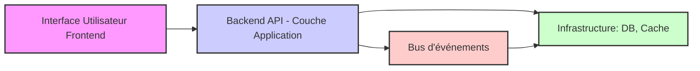

# Stratégies de déploiement pour les applications basées sur la Clean Architecture

La Clean Architecture encourage une séparation claire des responsabilités dans la conception des applications. Cette organisation impacte directement les stratégies de déploiement, influençant la modularité, la scalabilité, la maintenabilité et la résilience des systèmes. Comprendre les meilleures pratiques de déploiement adaptées à ces architectures permet d’optimiser leur exploitation en production.

---

## 1. Architecture modulaire et découplage : un atout pour le déploiement

Dans la Clean Architecture, les couches (Domaine, Application, Infrastructure, Interface utilisateur) sont **faiblement couplées** et séparées par des interfaces. Cela autorise plusieurs stratégies de déploiement :

- Déploiement **monolithique** avec tous les modules liés dans un seul binaire/exécutable.  
- Déploiement **microservices** en découplant les fonctionnalités selon les domaines métier.  
- Déploiement **modulaire** (modular monolith) avec séparation logique mais packaging centralisé.  

Ces choix influent sur la distribution, la gestion des versions, et la scalabilité.

---

## 2. Packaging et conteneurisation

### Conteneurs Docker 

L’isolation et la portabilité des applications reposant sur la Clean Architecture profitent de la conteneurisation.

- Chaque couche (notamment la couche Infrastructure) peut être packagée dans un container ou service distinct.  
- Par exemple, l’API, la base de données, le cache, et le frontend peuvent être conteneurisés séparément.  
- Le déploiement devient déclaratif et automatisable (Docker Compose, Kubernetes).

### Exemple

```yaml
version: "3.8"
services:
  api:
    build: ./api
    ports:
      - "5000:80"
    depends_on:
      - db
  db:
    image: postgres:14
    environment:
      POSTGRES_USER: user
      POSTGRES_PASSWORD: pass
    volumes:
      - db_data:/var/lib/postgresql/data
      
volumes:
  db_data:
```

---

## 3. Déploiement continu (CI/CD) avec gestion des couches

Les pipelines CI/CD optimisés pour la Clean Architecture :

- **Build et test par couche** : validations unitaires dans la couche Domaine, tests d’intégration côté Infrastructure.  
- **Déploiement progressif** : par module, microservice ou couche, avec rollback simplifié.  
- **Tests automatisés** : intégration continue déclencheant tests unitaires, d’intégration et fonctionnels bout en bout.

Le découplage facilite le déploiement indépendant des composants : l’interface utilisateur peut être déployée sans modifier la couche Application, par exemple.

---

## 4. Stratégies de scalabilité

- **Scalabilité horizontale** de l’interface utilisateur (web ou mobile) et des API.  
- Scalabilité des composants Infrastructure indépendamment (bases de données, files de messages).  
- Isoler le domaine métier pour implémenter des architectures orientées événements ou CQRS.

---

## 5. Diagramme Mermaid synthétisant la stratégie de déploiement



---

## 6. Exemple de déploiement modulaire avec Kubernetes

Chaque service (API, base, interface) déployé dans un Pod distinct, évolutif indépendamment et supervisé.

```yaml
apiVersion: apps/v1
kind: Deployment
metadata:
  name: api-deployment
spec:
  replicas: 3
  selector:
    matchLabels:
      app: api
  template:
    metadata:
      labels:
        app: api
    spec:
      containers:
      - name: api-container
        image: moncollectif/api:latest
        ports:
        - containerPort: 80
```

---

## 7. Sources et références

- Robert C. Martin, *Clean Architecture*, 2017  
- Kubernetes Official Documentation: https://kubernetes.io/docs/home/  
- Docker Docs: https://docs.docker.com/  
- Martin Fowler, [Microservices and Modularization](https://martinfowler.com/articles/microservices.html)  
- Microsoft Docs, [Deploying microservices on Azure Kubernetes Service](https://docs.microsoft.com/en-us/azure/aks/)

---

En conclusion, les applications suivant la Clean Architecture bénéficient pleinement des approches modernes de déploiement modulaire, conteneurisé et automatisé. Cette organisation garantit une meilleure gestion de la complexité, une agility opérationnelle et une évolutivité facilitée en production.