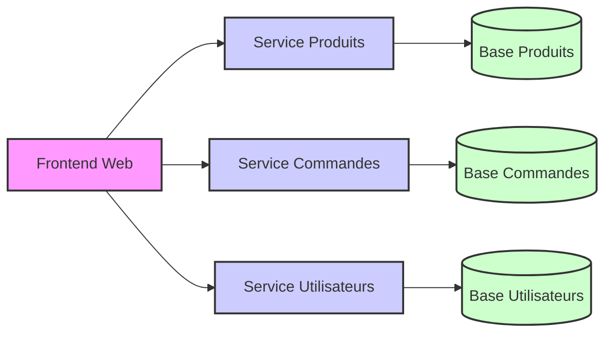

# Conteneurisation et microservices dans les déploiements basés sur la Clean Architecture

La séparation des responsabilités propre à la Clean Architecture facilite l’adoption des architectures **microservices** et de la **conteneurisation**, deux piliers des systèmes modernes scalables et agiles. Cet article explicite comment tirer parti de ces technologies dans un contexte Clean Architecture pour optimiser le déploiement et la maintenance.

---

## 1. Contexte : modulaire par conception

La Clean Architecture agencée en couches découple le domaine métier, la logique applicative, l’infrastructure et l’interface utilisateur. Cette organisation permet :

- D’isoler les fonctionnalités en modules indépendants.  
- De distribuer ces modules sous forme de services distincts (microservices).  
- D’emballer ces services dans des conteneurs pour une portabilité maximale.

---

## 2. Conteneurisation : principes et bénéfices

### Principes

- Un **conteneur** virtualise un environnement d’exécution léger et isolé contenant tout le nécessaire au fonctionnement d’un service.  
- Chaque service (microservice ou module) fonctionne dans son propre conteneur.  
- Favorise la cohérence entre environnement de développement, test et production.

### Bénéfices

- **Portabilité** : même image de conteneur sur tout type d’infrastructure.  
- **Isolation** : conflits minimaux entre dépendances.  
- **Déploiement rapide et automatisé** via orchestrateurs (Kubernetes, Docker Swarm).  

---

## 3. Microservices : découpage orienté domaine

### Définition

Une approche microservices divise une application en services métier indépendants, each responsable d’une fonctionnalité précise, avec son propre modèle de données.

### Avantages en lien avec la Clean Architecture

- Maintien d’une **separation of concerns** forte.  
- Possibilité de **choisir des technologies ou bases adaptées** à chaque service.  
- Scalabilité fine sur chacune des fonctionnalités.  
- Mise à jour et déploiement indépendants sans impact sur l’ensemble.

---

## 4. Exemple concret

Une application e-commerce en Clean Architecture peut être divisée ainsi :

- **Service Produits** : gestion des catalogues, pricing.  
- **Service Commandes** : gestion des commandes, paiements.  
- **Service Utilisateurs** : authentification, profils clients.  
- **Frontend Web** : interface utilisateur.

Chaque service est conteneurisé, déployé et mis à l’échelle indépendamment.

---

## 5. Diagramme Mermaid illustrant l’architecture microservices conteneurisée



---

## 6. Orchestration avec Kubernetes

Kubernetes permet de :

- Gérer automatiquement le cycle de vie des conteneurs.  
- Mettre à l’échelle indépendamment chaque microservice selon la charge.  
- Gérer la découverte de service et le routage.  
- Assurer la résilience (redémarrage, répartition de charge).

---

## 7. Exemple de manifeste Kubernetes simplifié pour un microservice

```yaml
apiVersion: apps/v1
kind: Deployment
metadata:
  name: service-produits
spec:
  replicas: 3
  selector:
    matchLabels:
      app: produits
  template:
    metadata:
      labels:
        app: produits
    spec:
      containers:
      - name: produits-container
        image: monregistrer/service-produits:latest
        ports:
        - containerPort: 8080
---
apiVersion: v1
kind: Service
metadata:
  name: service-produits
spec:
  selector:
    app: produits
  ports:
    - protocol: TCP
      port: 80
      targetPort: 8080
  type: ClusterIP
```

---

## 8. Sources et références

- Docker Official Documentation: https://docs.docker.com/  
- Kubernetes Documentation: https://kubernetes.io/docs/home/  
- Sam Newman, *Building Microservices*, 2015  
- Martin Fowler, [Microservices](https://martinfowler.com/articles/microservices.html)  
- Microsoft Docs, [Microservices architecture e-book](https://docs.microsoft.com/en-us/dotnet/architecture/microservices/)  

---

La conteneurisation et l’architecture microservices exploitent pleinement la modularité imposée par la Clean Architecture. Elles offrent une base technique agile, scalable et maintenable pour les applications modernes complexes.