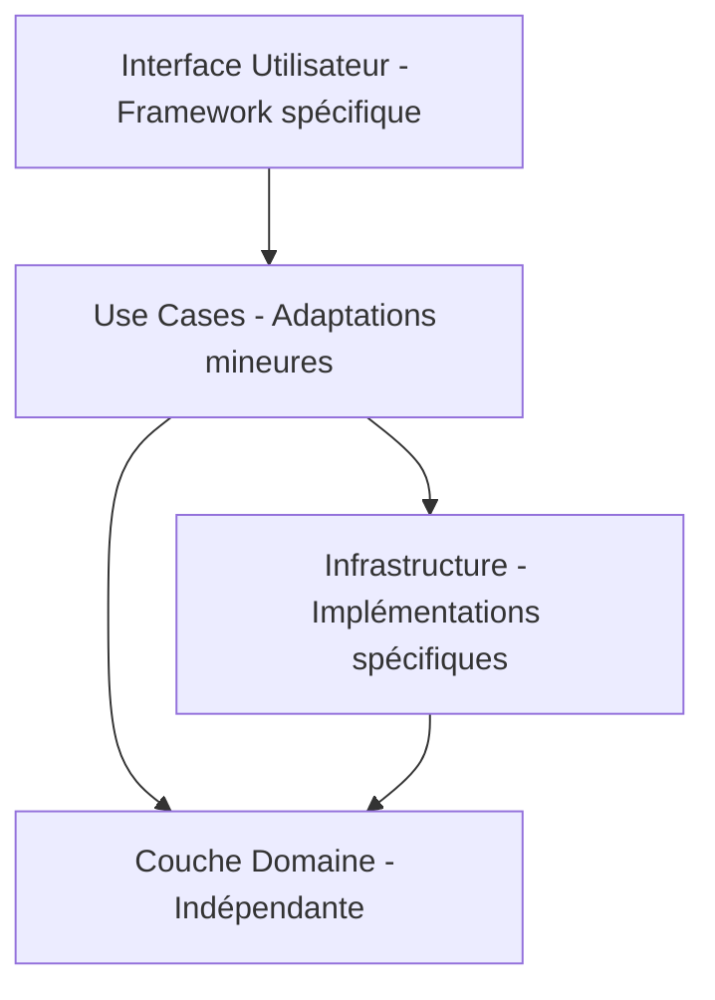

# Adaptation des principes de la Clean Architecture aux spécificités technologiques

La Clean Architecture définit un canevas clair pour structurer les applications via des couches indépendantes. Cependant, chaque technologie possède ses caractéristiques propres (langage, écosystème, conventions) qui imposent d’adapter ces principes sans en compromettre l’intégrité. Cet article explique comment appliquer la Clean Architecture tout en tenant compte des spécificités des plateformes courantes (ASP.NET Core, Node.js, Spring Boot, Next.js).

---

## 1. Règle d'or : préserver l’indépendance du domaine métier

Le cœur est un modèle indépendant, la partie la moins sujette à adaptation.  
Toute adaptation concerne essentiellement **l’implémentation des couches extérieures** (application, infrastructure, interface utilisateur).

---

## 2. Adaptation au paradigme du langage et au framework

| Technologie  | Spécificités à considérer              | Adaptation Clean Architecture                                 |
|--------------|---------------------------------------|---------------------------------------------------------------|
| ASP.NET Core | Fort typage statique, DI native      | Interfaces C# dans le domaine, IoC container `Microsoft.Extensions.DependencyInjection` pour injection des use cases et repos. |
| Node.js (TS) | Typage optionnel, async natif, IOC via libs | Modules et interfaces en TypeScript, gestion asynchrone promesses, utilisation d’`inversify` ou NestJS pour DI.   |
| Spring Boot  | Basé sur annotations, IoC container volumineux | Annotations `@Service`, `@Repository` pour séparer couches, configuration XML ou Java Config, tests avec Spring Boot Test.    |
| Next.js (14) | Paradigm React + API Serverless      | Logique métier dans des modules réutilisables, API routes en tant qu’adaptateurs, intégration TypeScript pour typings stricts. |

---

## 3. Gestion des dépendances externes

Certaines technologies proposent des bibliothèques ou frameworks propres qui influencent l’infrastructure :

- **Base de données** : EF Core pour ASP.NET, TypeORM ou Prisma pour Node.js, Spring Data pour Spring Boot.  
- **Sécurité** : IdentityServer (ASP.NET), Passport.js (Node.js), Spring Security (Spring Boot).  
- **Testing** : xUnit/NUnit (ASP.NET), Jest/Mocha (Node.js), JUnit/Mockito (Spring Boot), Testing Library (Next.js).

Le rôle des adaptateurs d’infrastructure est d’**adapter les appels à ces outils** en respectant l’interface attendue par les couches supérieures.

---

## 4. Exemple : injection de dépendances dans différentes technologies

### ASP.NET Core

```csharp
services.AddScoped<IUserRepository, UserRepository>();
services.AddScoped<IGetUserUseCase, GetUserUseCase>();
```

### Node.js avec `inversify`

```typescript
container.bind<IUserRepository>("IUserRepository").to(UserRepository);
container.bind<IGetUserUseCase>("IGetUserUseCase").to(GetUserUseCase);
```

### Spring Boot

```java
@Service
public class GetUserUseCase { ... }

@Repository
public interface UserRepository extends JpaRepository<User, Long> { }
```

Conférence automatique par composants annotés.

### Next.js

```typescript
export async function getUserService(userId: string): Promise<User> {
  // appelle Repository implémenté avec Prisma ou autre
}
```

---

## 5. Logique asynchrone et gestion d’erreurs

- Node.js et Next.js s’appuient sur les promesses et `async/await` pour le traitement asynchrone, impliquant une adaptation des use cases et des tests.  
- ASP.NET a ses mécanismes `async`/`await` avec Task.  
- Spring Boot utilise Exception Handling via contrôleurs et AOP.

---

## 6. Diagramme Mermaid : Adaptation des couches



Chaque couche d’adaptation se situe davantage vers l’extérieur, impérativement dépourvue de dépendances vers l’intérieur.

---

## 7. Conclusion rapide

L’application des principes de la Clean Architecture se traduit par une **mise en œuvre spécifique à chaque techno**. Le cœur reste stable alors que les adaptateurs et l’infrastructure changent, intégrant les meilleurs outils et pratiques disponibles dans chaque environnement.

---

## 8. Sources et lectures complémentaires

- Microsoft Docs, [Clean Architecture in .NET](https://docs.microsoft.com/en-us/dotnet/architecture/modern-web-apps-azure/common-web-application-architectures#clean-architecture)  
- Node.js Best Practices, https://github.com/goldbergyoni/nodebestpractices#clean-architecture  
- Spring Framework Documentation, https://spring.io/projects/spring-framework  
- Next.js Documentation, https://nextjs.org/docs  
- Robert C. Martin, *Clean Architecture*, 2017  

---

Ainsi, maîtriser les spécificités technologiques tout en appliquant la Clean Architecture permet d’allier rigueur architecturale et efficacité native du framework choisi.