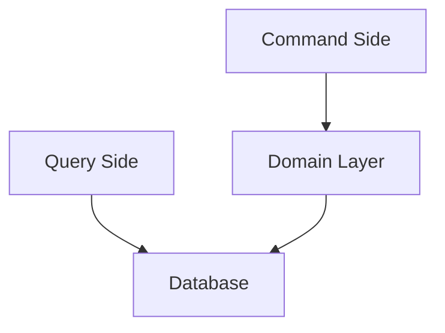
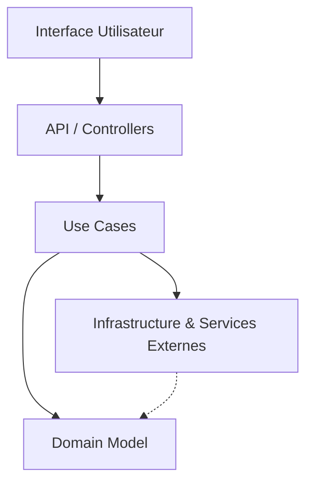

# Revue des évolutions récentes dans le domaine de la Clean Architecture

La Clean Architecture, imaginée par Robert C. Martin (Uncle Bob), continue de faire évoluer ses pratiques pour mieux s’adapter aux besoins actuels du développement logiciel. Son principe fondamental, la séparation claire des responsabilités et l’indépendance des couches, reste inchangé, mais son application s’enrichit avec les avancées technologiques et méthodologiques.

Voici une synthèse des tendances récentes observées sur la structuration, les outils et les méthodes pour implémenter une Clean Architecture moderne et efficace.

---

## 1. L’émergence des architectures hexagonales enrichies

Bien que la Clean Architecture elle-même soit une forme d'architecture hexagonale, la popularité de cette dernière a inspiré des pratiques plus systématiques autour des **ports et adaptateurs**, notamment avec :

- L'utilisation accrue de **Domain-Driven Design (DDD)** pour modéliser le domaine avec un accent renforcé sur les **aggregates** et les **bounded contexts**.  
- L’intégration aux frameworks **CQRS (Command Query Responsibility Segregation)** et **Event Sourcing**, permettant d’organiser clairement les opérations de commandes et de requêtes, améliorant la scalabilité et la clarté de la couche domaine.

### Exemple CQRS appliqué à la Clean Architecture

*Note :* La gestion distincte des commandes et lectures permet aussi d'isoler les modifications par rapport aux lectures, utile pour la robustesse.

---

## 2. Adoption de langages et frameworks supportant nativement l'inversion de dépendances

Les frameworks modernes accentuent l’inversion de contrôle (IoC) et les injections de dépendances, simplifiant l’application stricte des couches :  

- **ASP.NET Core** a popularisé une approche intégrée et légère de DI, facilitant le découplage.  
- **NestJS (Node.js)** guide naturellement vers le respect des principes de la Clean Architecture grâce à son système modulaire et son container IoC.  
- **Spring Boot** continue d’évoluer avec un support riche pour les architectures modulaires, annotations, et tests.

L’intégration native des principes architecturaux par ces frameworks fait gagner en maintenabilité et en vitesse de développement.

---

## 3. Tests automatisés et architecture

- Le développement piloté par les tests (**TDD**) gagne en adoption au sein des projets Clean Architecture, avec une organisation claire des tests unitaires et d’intégration par couche.  
- Les **mocks**, **stubs** et **fakes** s’imposent pour isoler correctement les tests de la logique métier.

L’outillage facilite à présent la vérification rapide et fiable du respect des frontières.

---

## 4. Microservices et conteneurisation associés à la Clean Architecture

Les dernières pratiques combinent les avantages des microservices à ceux de la Clean Architecture :  

- Chaque microservice encapsule son propre domaine et ses règles métier avec ses propres couches.  
- Les conteneurs (Docker, Kubernetes) favorisent un déploiement isolé et scalable.  
- L’orchestration introduit de nouvelles complexités (gestion des transactions distribuées, cohérence éventuelle, monitoring), ce qui invite à repenser parfois les limites des couches.

---

## 5. Exemple Mermaid synthétisant une Clean Architecture contemporaine

Ce modèle rappelle que le domaine reste libre des dépendances concrètes, tandis que l’infrastructure et les adaptateurs peuvent évoluer sans impacter la logique métier.

---

## 6. Sources et références

- Robert C. Martin, *Clean Architecture*, 2017  
- Microsoft Docs, [Modern Web Application Architectures - Clean Architecture](https://learn.microsoft.com/en-us/dotnet/architecture/modern-web-apps-azure/common-web-application-architectures#clean-architecture)  
- Vaughn Vernon, *Implementing Domain-Driven Design*, 2021  
- NestJS Documentation, https://docs.nestjs.com/  
- Martin Fowler, [CQRS](https://martinfowler.com/bliki/CQRS.html)  
- Red Hat Developers Blog, [Clean Architecture in Microservices](https://developers.redhat.com/blog/2022/01/12/building-maintainable-microservices-with-clean-architecture)  

---

Les évolutions récentes traduisent une meilleure maturité et adaptabilité de la Clean Architecture aux impératifs techniques modernes, alliant rigueur architecturale et flexibilité opérationnelle.