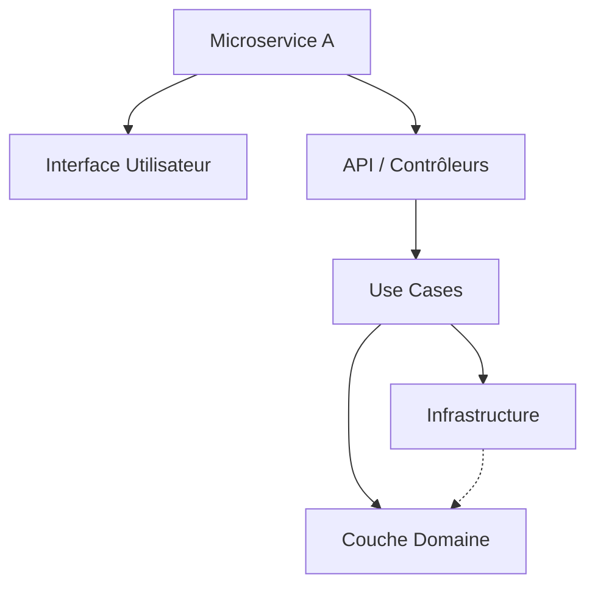
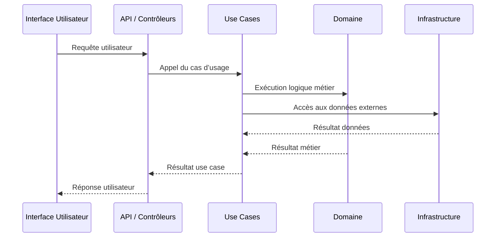

# Discussion ouverte et questions-réponses sur la Clean Architecture : perspectives et échanges pratiques

Au terme d’une exploration approfondie de la Clean Architecture, il est pertinent de s'engager dans une discussion ouverte portant sur les questions fréquemment posées, les doutes courants et les retours d’expérience. Cette démarche vise à confronter les concepts à la réalité des projets, à clarifier les ambiguïtés, et à aborder les préoccupations émergentes.

---

## 1. Quels sont les défis majeurs rencontrés lors de l’implémentation ?

- **Complexité initiale** : La mise en place d’une architecture strictement découplée impose une montée en compétence et un effort initial que certaines équipes sous-estiment.  
- **Sur-ingénierie** : Parfois, la sur-application des principes conduit à des couches trop nombreuses, rendant le projet lourd au quotidien. Il faut trouver un équilibre pragmatique.  
- **Gestion des dépendances** : Assurer la bonne inversion des dépendances via interfaces et container IoC demande rigueur et discipline.

**Réponse pratique** : Commencer par isoler le domaine et organiser progressivement les couches autour. Adapter la Clean Architecture au contexte sans chercher à la reproduire mécaniquement.

---

## 2. Comment concilier Clean Architecture avec les architectures microservices ?

- Chaque microservice encapsule un domaine unique, ce qui s’aligne naturellement avec la Clean Architecture.  
- Les microservices peuvent internaliser leur propre Clean Architecture.  
- La communication entre microservices via API REST ou événements respecte aussi l’isolation des couches.

Diagramme Mermaid illustrant un service basé sur Clean Architecture dans un environnement microservices :

Les microservices interagissent via des API externes, sans violer leurs propres frontières internes.

---

## 3. Quels sont les outils et plateformes recommandés pour faciliter l'implémentation ?

- **Frameworks d’injection de dépendances** : Spring (Java), ASP.NET Core (C#), NestJS (TypeScript).  
- **Outils de tests** : xUnit, JUnit, Jest, Mocha, combinés à des bibliothèques de mocks comme Moq ou Sinon.js.  
- **Analyse statique** : SonarQube pour maintenir la qualité du code et détecter les violations des dépendances.  
- **CI/CD** : Pipelines automatisés permettant d’intégrer les tests et de déployer de manière répétable.

---

## 4. Comment adapter la Clean Architecture pour les projets agiles et itératifs ?

- Implanter les couches progressivement, en démarrant par un MVP simple.  
- Refactorer régulièrement la structure au fur et à mesure des besoins.  
- Favoriser la modularité et l’indépendance pour faciliter les évolutions sans rupture.

---

## 5. Exemples pratiques de questions-réponses courantes

| Question                                         | Réponse synthétique                                                           |
|-------------------------------------------------|------------------------------------------------------------------------------|
| Peut-on mélanger les règles de la Clean Architecture avec d’autres patterns ? | Oui, notamment DDD, CQRS, Event Sourcing, à condition de garder la séparation des responsabilités. |
| Comment gérer les exceptions dans les différentes couches ?               | Chaque couche gère ses erreurs localement et transmet des exceptions adaptées vers l’extérieur. |
| Est-ce adapté aux petites applications ?                                  | L’architecture peut être simplifiée, mais les principes restent pertinents dès que la complexité croît. |

---

## 6. Diagramme Mermaid : parcours typique de la demande utilisateur

---

## 7. Sources utilisées

- Microsoft Docs, [Clean Architecture in Modern Web Apps](https://docs.microsoft.com/en-us/dotnet/architecture/modern-web-apps-azure/common-web-application-architectures#clean-architecture)  
- Robert C. Martin, *Clean Architecture*, 2017  
- NestJS Documentation, https://docs.nestjs.com/  
- Martin Fowler, [Patterns of Enterprise Application Architecture](https://martinfowler.com/eaaCatalog/)  
- Vaughn Vernon, *Implementing Domain-Driven Design*, 2021  

---

Cette exploration interactive autour des questions pratiques permet d’affiner la compréhension et d’adapter la Clean Architecture aux besoins concrets, tout en tirant parti des outils et bonnes pratiques modernes.